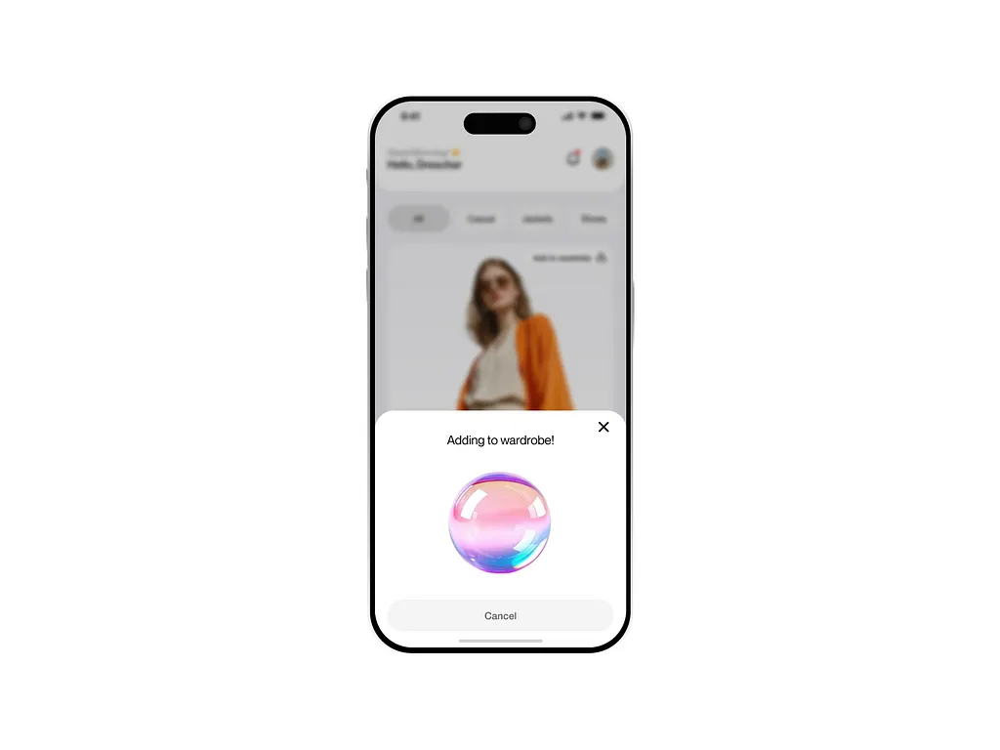

# TryFit — AI Virtual Try-On Shopping

Try clothes on yourself before you buy. Upload a photo, pick any outfit, and see it on you in seconds. Built for India, priced in ₹.

**Package:** `com.kurupdevs.tryfit` · **Version:** 1.0.0 · **minSdk 26** · **targetSdk 35**

---

## Screenshots

> Design previews — the UI is built to match these reference designs pixel-for-pixel.

| Onboarding | Home · Try-On · Wardrobe |
|---|---|
|  |  |

| Add to Wardrobe | Product Quick View · Size · Checkout |
|---|---|
|  |  |

---

## What's inside

### AI Virtual Try-On
- **One-photo avatar** — upload a single photo, get a reusable digital avatar
- **Screenshot try-on** — screenshot any outfit from Instagram/Myntra, try it on instantly
- **Multi-garment outfits** — combine top + bottom + shoes in one try-on
- **Before/after slider** and **beat-synced transition video** for sharing
- Honest labeling throughout: "AI preview, not a fit guarantee"

### Shopping
- **48 products** across 6 categories: casual (15), jackets (7), tops (6), shoes (8), bags (6), ethnic wear (6)
- Original catalog with fictional Indian brands — Urbanco, Threadline, Kardo, Nilaya, Mehra & Co., Arqive
- Product quick-view bottom sheet with size selector and honest size guidance
- Demo checkout flow with order tracking timeline

### Wardrobe & Smart Features
- **Digital wardrobe** — save items, add notes, filter by category
- **AI Stylist chat** — outfit advice in English + Hindi
- **Outfit scorer** — rates your combinations
- **Closet digitizer** — snap your real clothes to add them
- **Cost-per-wear tracker** — see the real value of each purchase
- **Price-drop alerts** — get notified when wishlist items go on sale
- **Calendar integration** — plan outfits for events

### Social & Viral
- **Share looks** via public links with voting
- Before/after video export for Reels/Shorts
- Hindi language support throughout

### Privacy-first
- On-device photo processing — body photos never leave your phone for training
- Explicit consent before any AI processing
- Anonymous try-first mode, optional Google login
- No body-slimming filters, no fake "perfect fit" claims

---

## Tech stack

| Layer | Tech |
|---|---|
| UI | Kotlin + Jetpack Compose (Material 3) |
| Architecture | MVVM, manual DI, offline-first |
| Local DB | Room (wardrobe, history, notifications) |
| Backend | Supabase (Postgres + Auth + Storage) |
| Image loading | Coil 3 |
| Try-on engine | Pluggable — demo compositor now, fal.ai / Kling / FASHN slots ready server-side |
| Push | FCM (wiring pending) |

**Try-on providers:** the commercial engine abstraction supports fal.ai, Kling (Kolors-class) and FASHN via server-side keys. Demo mode ships in the APK so the full flow works without any API key. No secrets are embedded in the app.

---

## Project layout

```
virtual-tryon-app/
├── app/src/main/java/com/kurupdevs/tryfit/
│   ├── MainActivity.kt / TryFitApplication.kt
│   ├── di/AppContainer.kt          # manual DI
│   ├── data/                       # repositories, Room DB, Supabase client
│   │   └── db/                     # TryFitDatabase + DAOs
│   ├── navigation/                 # 5-tab nav graph
│   ├── tryon/                      # try-on engine, camera, flow
│   ├── worker/                     # price-drop background worker
│   └── ui/
│       ├── theme/                  # design tokens (colors, type, shape)
│       ├── components/             # bottom sheets, cards, shared UI
│       └── screens/                # onboarding, home, product, wardrobe,
│                                   # tryon, checkout, stylist, profile, settings
├── modules/tryon-engine/           # pure-Kotlin try-on pipeline
├── supabase/                       # migrations + Edge Functions
└── docs/screenshots/               # app screenshots
```

---

## Build

**Prereqs:** JDK 17, Android SDK (platform 35, build-tools 35.0.1)

The project uses a manual build pipeline (Gradle daemon is blocked in this environment):

```sh
# Pass 1: Kotlin + KSP compile (Room codegen via manual _Impl)
./build-manual-pass1.sh

# Pass 2: D8 dex + APK package + sign
./build-manual-pass2.sh
```

Output: `.build/apk/TryFit-debug.apk` (signed, ~33 MB)

**Notes:**
- Supabase BOM pinned to **3.1.4** — newer 3.x ships Kotlin 2.4 metadata, unreadable by the Kotlin 2.1 toolchain
- Room's KSP codegen is replaced by hand-written `TryFitDatabase_Impl` + DAO impls in `data/db/` (KSP silently produces no output in the manual pipeline)
- `local.properties` with Supabase URL/anon key is gitignored — never commit secrets

---

## Roadmap
- [ ] Supabase project wiring (URL + anon key + `shared-looks` bucket)
- [ ] Commercial try-on provider key (server-side)
- [ ] FCM push notifications
- [ ] Real payment gateway (Razorpay)
- [ ] ML Kit on-device analyzer (currently stubbed)

---
